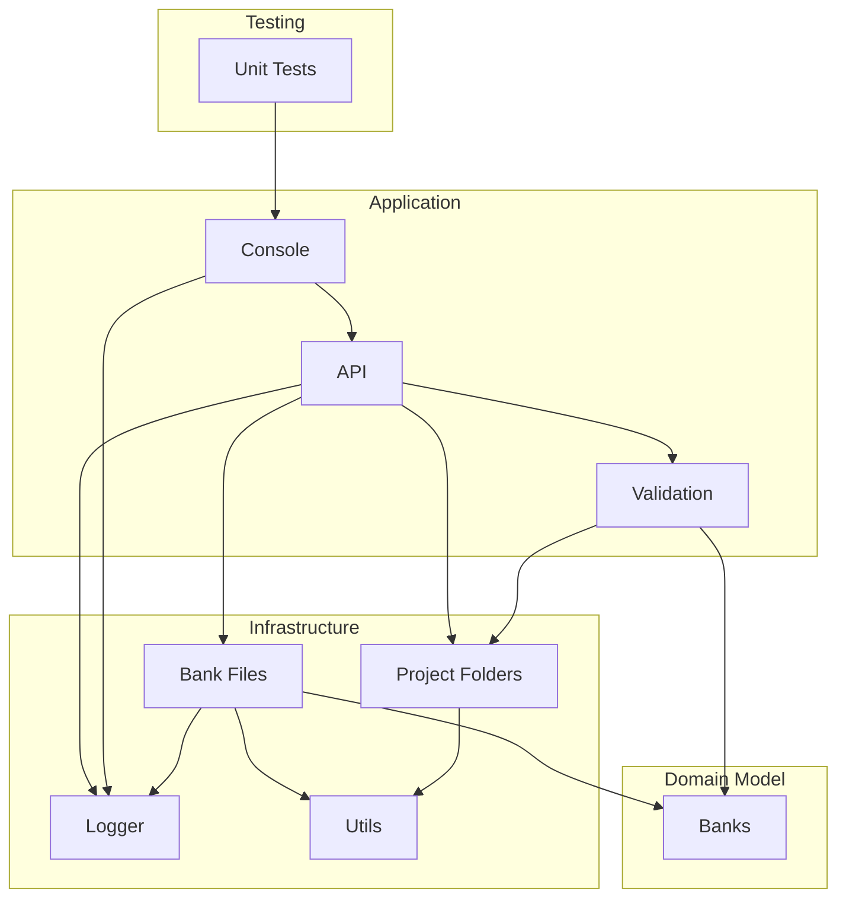

# 🗃 Octatrack Bank Manager
[⚙️ Setup](#-setup) | [💻 Usage](#-usage) | [📂 Example](#-example) | [🥽 Development](#-development) | [📐 Architecture](#-architecture)

* Copies and renames Octatrack banks from a specified project folder to a new project folder
* This independently developed software has no affiliation with Elektron Music Machines

**⚠️ Disclaimer: Use this tool only on *copies* of your project folders. Do not use this directly with your Octatrack. Always keep backups!**

# ⚙️ Setup
Requirements: Octatrack projects and Java.
1. Copy some Octatrack project folder(s) to your computer.
2. Install [Java](https://www.java.com/en/download/) if you don't have it.
3. Download Octatrack Bank Manager [here](https://github.com/tmprd/octatrack-banks/releases/latest)!

# 💻 Usage
Run this tool with two inputs (see [example](#-example) below):

1. The name or path of the source project folder you want to copy banks from specified with the command-line argument `--source` or `-s`. This folder should contain 16 bank files.

2. A config file which contains pairs of source and target banks. Each source bank file in the source project folder will be copied and renamed to its target bank number in the new, target project folder. See the configuration section below.

### Configuration
* By default, the config file is expected to be named `<your-project-folder-path>.config`. You can provide your own config file path using the command-line argument `--config` or `-c`.

* Each target and assigned source bank are specified using this syntax: `<target-bank-number>=<source-bank-number>`. To assign an empty bank, use `0`.
	* For example, `1=4` means bank 1 in the new, target project will be copied from bank 4 from the old, source project. `1=0` means bank 1 will be empty.

* Optional: Banks can also be specified with `--banks` or `-b` instead of using a config file.

### Command-line Options
```console
Usage: java -jar ot-banks.jar -s <my-project-folder-name> [options]

Inputs:
  -s, --source <arg>              Required: Source project folder path
  -t, --target <arg>  <computed>  Optional: Target project folder path
  -c, --config <arg>              Optional: Config file path
  -b, --banks <args>              Optional: Bank pairs
  -h, --help
```

# 📂 Example
If your project folder path is `"/projects/my-project"`, then create a config file at `"/projects/my-project.config"`. 

To assign bank 4 to bank 1 in the new project, write `1=4` in the config file. This will copy the source bank 4 from the `"my_project"` folder to target bank 1 in `"my_project_new"` folder. The name of the new, target project folder can also be specified with `--target`.

Example config file: `"my_project.config"`
```
1=4
2=5
3=6
4=0
5=0
6=0
```

Example command-line usage
```console
java -jar otbanks.jar -s "projects/my_project"

==>  O C T A T R A C K
==>  Using project folder: "projects/my_project"
==>  Copying "projects/my_project" to "projects/my_project_new"
==>  "1=4" ===> Copied bank04 to bank01
==>  "2=5" ===> Copied bank05 to bank02
==>  "3=6" ===> Copied bank06 to bank03
==>  "4=0" ===> Empty bank set as bank04
==>  "5=0" ===> Empty bank set as bank05
==>  "6=0" ===> Empty bank set as bank06
==>  Other project files copied
==>  (!!!) 9 missing banks: [7 8 9 10 11 13 14 15 16]
```

# 🥽 Development
Requirements: [Clojure](https://clojure.org/guides/install_clojure) and optionally [Babashka](https://babashka.org/) for fast startup using GraalVM.

I use this tool often with my Octatrack. But the code in this project also serves to demonstrate a few features and quirks of Clojure, such as [spec](https://clojure.org/about/spec) and [transducers](https://clojure.org/reference/transducers).

### Dev command-line usage
```shell
# Build (functions defined in build.clj)
clj -T:build clean
clj -T:build uber

# Test
clj -M:test

# Run
clj -M -m octatrack.application.console -s my_project
clj -M:dev my_project -s my_project

# Optional: override config file and use `--banks` instead
clj -M:dev -s my_project --banks 1=4 2=5 3=6 4=0 5=0 6=0

# Optional: run with Babashka
bb -m octatrack.application.console -s my_project

# Optional: List everything inside the built uberjar
jar -tvf ./target/uberjar/otbanks.jar
```

# 📐 Architecture
* Domain layer
	* Contains logic related to Octatrack Banks
	* Cross-platform implementation using `.cljc` (JVM & JavaScript)
* Infrastructure layer
	* Persists data changes as file & folder changes
* Application layer
	* Provides a way to interact with the domain models and corresponding files
	* Data is validated with domain specifications, defined with clojure spec's `s/def`
* Testing
	* The implementation of some functions is verified using `s/fdef`. These specifications are verified only during testing & development with `stest/instrument`.
	* Continuous testing is automated via Github Actions


